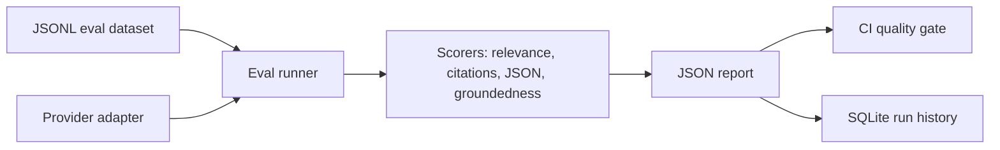

# LLM Evaluation & Observability Platform

Evaluation and monitoring platform for RAG and agent workflows.

## Why This Project

AI engineering interviews increasingly test whether you can make LLM systems reliable, measurable, and maintainable. This project focuses on evals, regression testing, trace collection, latency, cost, and quality gates.

## Target Resume Bullet

Built an LLM evaluation platform with regression datasets, automated scoring, prompt/version tracking, and CI quality gates for RAG and agent workflows.

## Architecture



## Implemented

- Store golden test cases for RAG and agent workflows.
- Run local prompt/model/version comparisons from JSONL datasets.
- Score answer relevance, citation correctness, groundedness, JSON validity, latency, and cost.
- Export JSON reports for CI and dashboards.
- Track failures by prompt version and dataset.
- Provider adapter interface with local `dataset-candidate` and `echo` providers.
- Optional OpenAI Responses API provider for real model evals.
- SQLite run history for tracking pass rate and groundedness over time.
- Unit tests for scorer behavior and runner summaries.

## Local Development

```bash
python -m venv .venv
.\.venv\Scripts\activate
pip install -e ".[dev]"
python -m evals.runner run datasets/sample.jsonl --report-path runs/sample-report.json
python -m pytest
python -m ruff check .
```

Persist run history to SQLite:

```bash
python -m evals.runner run datasets/sample.jsonl \
  --report-path runs/sample-report.json \
  --history-db runs/history.db
python -m evals.runner history runs/history.db
```

Evaluate with a different local provider:

```bash
python -m evals.runner run datasets/sample.jsonl --provider echo
```

Evaluate a real OpenAI model:

```bash
pip install -e ".[openai]"
$env:OPENAI_API_KEY="your_api_key"
python -m evals.runner run datasets/sample.jsonl --provider openai --model gpt-4.1
```

The OpenAI provider uses the Responses API and extracts inline citations from model answers
such as `[sample-report]`.

## Example Report Summary

The sample dataset currently passes the quality gate:

```json
{
  "total_cases": 2,
  "passed_cases": 2,
  "pass_rate": 1.0,
  "average_relevance": 1.0,
  "average_groundedness": 1.0,
  "average_citation": 1.0,
  "quality_gate_passed": true
}
```

## Interview Talking Points

- Reliability layer for LLM apps: evals, regression data, quality gates, and run history.
- Local-first design keeps development deterministic while still supporting real OpenAI model evals.
- Scoring separates answer relevance, citation correctness, groundedness, structured-output validity, latency, and cost.
- The project is designed to plug into RAG and agent systems as a CI quality gate.

## Roadmap

1. Add provider adapters for OpenAI and Bedrock.
2. Add prompt/model/version comparison reports.
3. Add a lightweight FastAPI endpoint for run history.
4. Connect this eval runner to the mortgage RAG copilot.
5. Add dashboard views for pass-rate trends and failure clustering.
